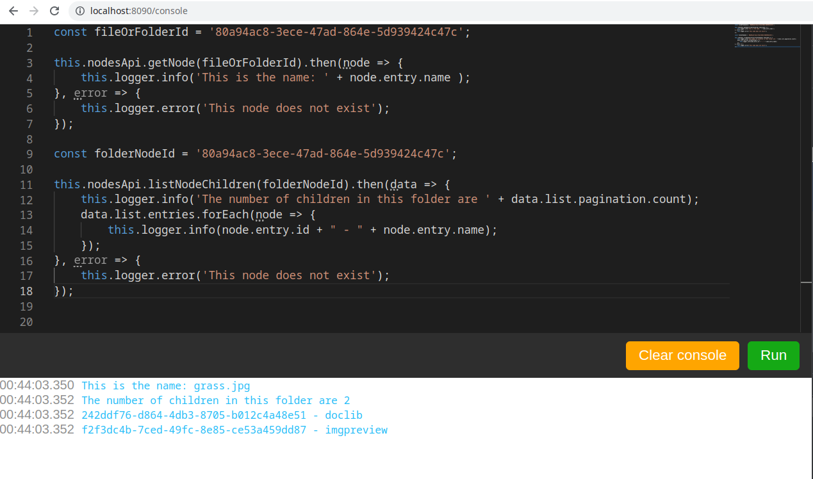

# AlfrescoJsConsole

A web browser console to run javascript against the Alfresco Rest API

This project is a modern alternative to the [javascript share console](https://github.com/share-extras/js-console) that don't support ACS 7.x

## Compatibility

| Product | ACS 5.2.x | ACS 6.x | ACS 7.x |    APS >= 1.9   |     APS 2.x     |
|:-------:|:---------:|:-------:|:-------:|:---------------:|:---------------:|
| Support |    yes    |   yes   |   yes   | not implemented | not implemented |

## Overview



## Available commands

### Logger

```js
this.logger.log("Hello");
this.logger.info("Hello");
this.logger.warn("Hello");
this.logger.error("Hello");
```

### Alfresco APIs

```js
this.nodesApi
```

## Development server

Run `ng serve` for a dev server. Navigate to `http://localhost:4200/`. The app will automatically reload if you change any of the source files.

## Code scaffolding

Run `ng generate component component-name` to generate a new component. You can also use `ng generate directive|pipe|service|class|guard|interface|enum|module`.

## Build

Run `ng build` to build the project. The build artifacts will be stored in the `dist/` directory.

## Build and run on Docker container

Run `./build_start.sh` to build a new container and deploy to nginx

This will setup a nginx container as web server for this app and a reverse proxy for Alfresco (For CORS issues)

The container is availlable at `http://localhost:8090/console` for the Javascript console and `http://localhost:8090/alfresco` for ACS

> Alfresco containers must be running: `./run.sh build_start` on your Alfresco project (SDK 4.x)

Alfresco containers and js-console container are comunicating throw the `docker_default` network

## Running unit tests

Run `ng test` to execute the unit tests via [Karma](https://karma-runner.github.io).

## Running end-to-end tests

Run `ng e2e` to execute the end-to-end tests via a platform of your choice. To use this command, you need to first add a package that implements end-to-end testing capabilities.

## Further help

To get more help on the Angular CLI use `ng help` or go check out the [Angular CLI Overview and Command Reference](https://angular.io/cli) page.

## Authors

- Sébastien Vallet <sebastien.vallet89@gmail.com>
